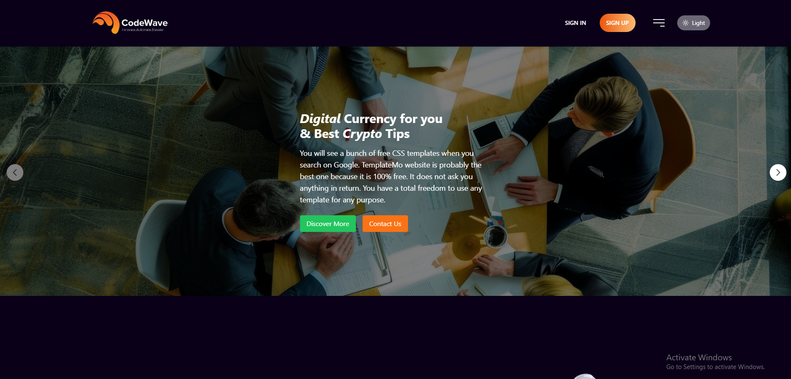
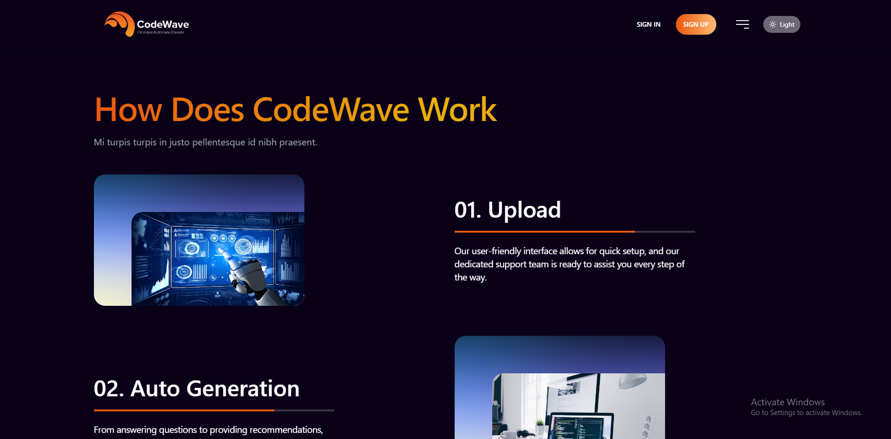
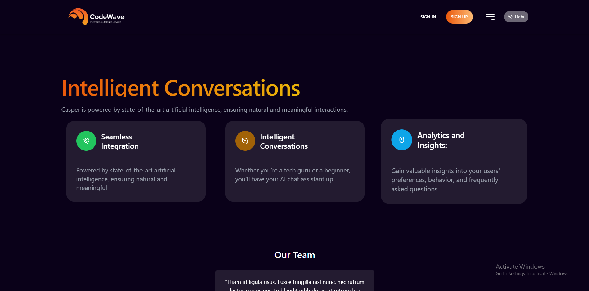

# CodeWave Site

## Technologies

### Backend
<ul>
  <li>Django</li>
  <li>SQLite</li>
  <li>JWT-Authentication</li>
</ul>

### Frontend
<ul>
  <li>React</li>
  <li>Tailwind</li>
  <li>JWT-Decode</li>
</ul>

## Backend Setup 
```
pip install -r requirements.txt
```

### Compiles for development (Backend)
```
python manage.py migrate
python manage.py runserver
```

## Frontend Setup 
```
npm install
```

### Compiles for development (Frontend)
```
npm run build
npm run dev
```

<hr>

#### Login


<hr>

#### Landing

<table>
  <tr>
    <td></td>
    <td></td>
    <td></td>
  </tr>
  <tr>
    <td></td>
    <td></td>
    <td></td>
  </tr>
  
</table>

<hr>

#### Sign Up


